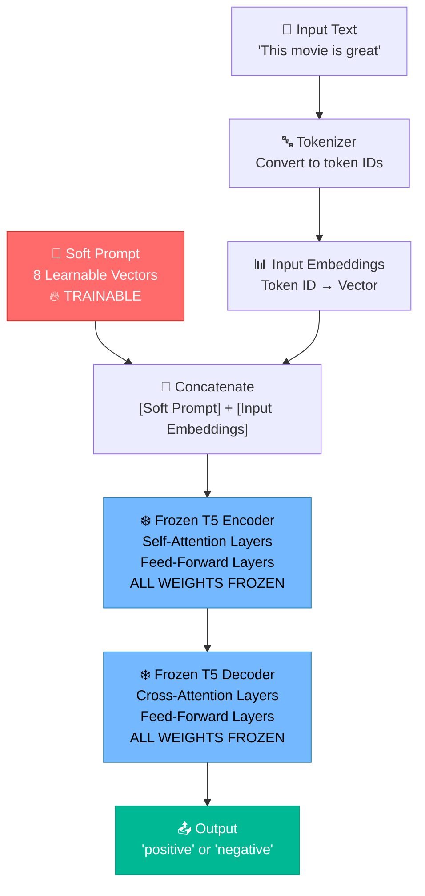
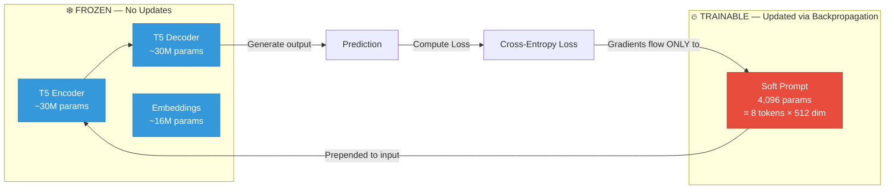
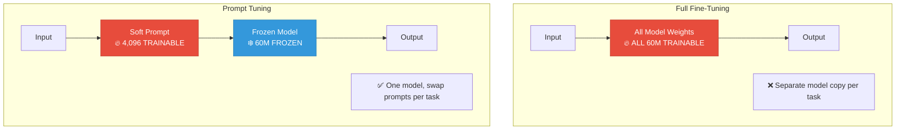

# The Power of Scale for Parameter-Efficient Prompt Tuning

> **Paper:** Lester, Al-Rfou, Raffel (2021) — [arXiv:2104.08691](https://arxiv.org/abs/2104.08691)
>
> **Implementation:** Single-file PoC using T5-Small + PEFT on SST-2

---

## Table of Contents

1. [Introduction](#1-introduction)
2. [Paper Summary](#2-paper-summary)
3. [Core Concepts](#3-core-concepts)
4. [Architecture Diagram](#4-architecture-diagram)
5. [Advantages](#5-advantages)
6. [Limitations](#6-limitations)
7. [Future Scope](#7-future-scope)
8. [Engineering Analysis](#8-engineering-analysis)
9. [How to Run](#9-how-to-run)
10. [Viva Preparation — Top 25 Questions & Answers](#10-viva-preparation)
11. [Demo Script (3-Minute Walkthrough)](#11-demo-script)
12. [Conclusion](#12-conclusion)
13. [References](#13-references)

---

## 1. Introduction

### What is Prompt Tuning?

Prompt Tuning is a **parameter-efficient fine-tuning (PEFT)** technique where, instead of updating all the weights of a large language model, we **freeze the entire model** and only train a small set of continuous vectors called **soft prompts**. These soft prompt vectors are prepended to the input and learned through backpropagation — the model itself never changes.

Think of it like this: instead of retraining a teacher (the model), you give the teacher a **customised instruction card** (the soft prompt) that tells them exactly how to handle a specific task.

### Why was Prompt Tuning Introduced?

As language models grew from millions to billions of parameters, **full fine-tuning** became impractical:

| Problem                  | Description                                                  |
| ------------------------ | ------------------------------------------------------------ |
| **Cost**                 | Fine-tuning GPT-3 (175 B params) requires enormous GPU memory and compute |
| **Storage**              | Each task needs a separate copy of the entire model           |
| **Scalability**          | Serving 100 tasks = storing 100 full model copies             |
| **Catastrophic Forgetting** | Updating all weights can degrade performance on other tasks |

Prompt Tuning solves all of these by training **< 0.01%** of the parameters while keeping the model frozen.

### Problem with Full Fine-Tuning

In full fine-tuning, **every single parameter** in the model is updated during training. For a model like T5-Small (≈60 M params), this is manageable. But for T5-XXL (11 B params) or GPT-3 (175 B params), this means:

- Updating **billions** of floating-point numbers each training step
- Needing **multiple high-end GPUs** just for gradient storage
- Creating a **completely separate model copy** for every downstream task

Prompt Tuning eliminates this overhead entirely.

---

## 2. Paper Summary

### Objective

The paper proposes **Prompt Tuning** as a simple, scalable alternative to full fine-tuning. The authors demonstrate that as models scale up, prompt tuning performance **converges to that of full fine-tuning** — making it a practical drop-in replacement for large models.

### Methodology

1. **Freeze** the entire pretrained language model (T5 in the paper)
2. **Prepend** a sequence of learnable continuous vectors (soft prompts) to the input embeddings
3. **Train only** these soft prompt vectors via backpropagation on the downstream task
4. The model processes `[soft_prompt_tokens] + [input_tokens]` as if the soft prompts were part of the natural input

### Key Findings

| Finding | Detail |
| ------- | ------ |
| **Scale closes the gap** | At T5-XXL (11B), prompt tuning matches full fine-tuning on SuperGLUE |
| **Tiny parameter footprint** | Only **0.001%** of model parameters are trainable |
| **Task-specific modularity** | One frozen model can serve many tasks by swapping soft prompts |
| **Robustness to domain shift** | Prompt-tuned models generalise better than fully fine-tuned ones |
| **Prompt length** | 20–100 virtual tokens is sufficient for most tasks |
| **Initialisation matters** | Initialising soft prompts from vocabulary embeddings (e.g., class labels) outperforms random init, especially for smaller models |

---

## 3. Core Concepts

### Frozen Model

The **frozen model** is the pretrained language model (e.g., T5-Small) whose weights are **completely locked** during training. No gradient updates flow into the model's original parameters. This is what makes prompt tuning so efficient — you never modify the billions of pretrained weights.

```
Frozen Model Weights: ❄️ NO updates
Soft Prompt Weights:  🔥 TRAINED via backpropagation
```

### Soft Prompts

Soft prompts are **learnable continuous vectors** that live in the model's embedding space. Unlike "hard" prompts (actual English words like "Classify this review:"), soft prompts are **not constrained to real words**. They are free-floating vectors that the model learns to interpret through training.

**Key difference:**

| Feature        | Hard Prompt                        | Soft Prompt                              |
| -------------- | ---------------------------------- | ---------------------------------------- |
| Format         | Real English words                 | Continuous embedding vectors             |
| Trainable?     | No (manually written)              | Yes (learned via backpropagation)        |
| Expressiveness | Limited to human vocabulary        | Can represent any point in embedding space |
| Example        | "Is this review positive or negative?" | `[0.23, -0.41, 0.87, ...]` × N tokens  |

### Trainable Parameters

In our implementations with T5-Small, we support two virtual token configurations:

- **Primary Applications (Streamlit Dashboard & Interactive CLI App)**:
  - **Total model parameters**: ~60.5 million
  - **Soft prompt parameters**: 20 virtual tokens × 512 embedding dim = **10,240**
  - **Percentage trainable**: ~0.0169% (only ~10K trainable weights!)
  
- **Minimal Programmatic PoC Script (`prompt_tuning_poc.py`)**:
  - **Total model parameters**: ~60.5 million
  - **Soft prompt parameters**: 8 virtual tokens × 512 embedding dim = **4,096**
  - **Percentage trainable**: ~0.0068% (fewer than 5K trainable weights!)

### Parameter Efficiency

Parameter efficiency measures how much task performance you get per trainable parameter:

```
Efficiency = Task Performance / Number of Trainable Parameters
```

Prompt Tuning achieves high efficiency because:
- The frozen model already "knows" language from pretraining
- The soft prompt only needs to *steer* the model toward the right task
- Fewer parameters = less overfitting, faster training, lower memory

---

## 4. Architecture Diagram

### How Prompt Tuning Works



### Training Flow — What Gets Updated?



### Prompt Tuning vs Full Fine-Tuning



---

## 5. Advantages

| # | Advantage | Explanation |
|---|-----------|-------------|
| 1 | **Extreme parameter efficiency** | Only 0.001–0.01% of parameters are trainable |
| 2 | **One model, many tasks** | Store one frozen model + tiny prompt files per task |
| 3 | **Lower compute cost** | Training is 10–100× cheaper than full fine-tuning |
| 4 | **Better domain transfer** | Frozen model retains broad knowledge; less overfitting |
| 5 | **Fast training** | Converges quickly since so few parameters update |
| 6 | **Easy deployment** | Swap a ~16 KB prompt file to switch tasks instantly |
| 7 | **No catastrophic forgetting** | Model weights never change, so no knowledge is lost |

---

## 6. Limitations

| # | Limitation | Explanation |
|---|-----------|-------------|
| 1 | **Needs large models** | At small scale (T5-Small), prompt tuning lags behind full fine-tuning |
| 2 | **Sensitive to initialisation** | Random init works poorly; vocabulary-based init is needed for small models |
| 3 | **Limited task complexity** | May struggle with highly complex tasks requiring deep model adaptation |
| 4 | **Prompt length trade-off** | Too few tokens = underfitting; too many = diminishing returns |
| 5 | **Interpretability** | Soft prompts are continuous vectors — not human-readable |

---

## 7. Future Scope

1. **Prompt Transfer Learning** — Reusing soft prompts across related tasks
2. **Multi-task Prompt Tuning** — Training a single prompt for multiple tasks simultaneously
3. **Combining with other PEFT methods** — LoRA + Prompt Tuning hybrids
4. **Vision-Language Prompt Tuning** — Extending to multi-modal models (e.g., CLIP, Flamingo)
5. **Prompt Compression** — Reducing the number of virtual tokens while maintaining performance
6. **Automated Prompt Search** — Using neural architecture search for optimal prompt configurations

---

## 8. Engineering Analysis

### Full Fine-Tuning vs Prompt Tuning — Detailed Comparison

| Feature | Full Fine-Tuning | Prompt Tuning |
| ------- | ---------------- | ------------- |
| **Trainable Parameters** | ~60.5 M (100%) | ~10,240 (0.0169%) *[1]* |
| **Training Speed** | Slow — gradients for all layers | Fast — gradients only for prompt |
| **Memory Usage** | High — optimizer states for all params | Very Low — optimizer states for ~10K params |
| **Storage per Task** | ~242 MB (full model copy) | ~40 KB (prompt vectors only) |
| **Cost (GPU Hours)** | High | Minimal (runs on CPU/single GPU) |
| **Risk of Overfitting** | Higher on small datasets | Lower — fewer params to overfit |
| **Multi-task Serving** | N model copies for N tasks | 1 model + N tiny prompt files |
| **Catastrophic Forgetting** | Possible | Impossible (model is frozen) |

*Note [1]: Trains 10,240 parameters (20 virtual tokens) in the Streamlit and CLI apps, and 4,096 parameters (8 virtual tokens) in the minimal PoC script.*

### Row-by-Row Explanation

**Trainable Parameters:**
Full fine-tuning updates every weight in the model (~60.5M for T5-Small). Prompt Tuning only trains the soft prompt vectors:
- **CLI / Streamlit Apps**: 20 tokens × 512 dimensions = 10,240 parameters (a **5,909× reduction**).
- **Programmatic PoC**: 8 tokens × 512 dimensions = 4,096 parameters (a **14,700× reduction**).

**Training Speed:**
In full fine-tuning, every backward pass computes gradients for all layers. In Prompt Tuning, gradients are only computed for the soft prompt — the frozen layers don't need gradient computation for their own parameters (though activations still flow through them). This significantly reduces the compute per step.

**Memory Usage:**
The Adam optimiser stores 2 extra copies of every trainable parameter (momentum + variance). For full fine-tuning: 60.5M × 3 × 4 bytes ≈ 726 MB. For Prompt Tuning (20 tokens): 10,240 × 3 × 4 bytes ≈ 120 KB. The difference is dramatic.

**Cost:**
Full fine-tuning of large models requires expensive multi-GPU setups. Prompt Tuning of even large models can often be done on a single consumer GPU because the optimizer memory is negligible.

## 9. How to Run

### Prerequisites

To run any of the implementations, install the required packages:

```bash
pip install torch transformers peft datasets streamlit
```

### 🎮 Option A: Streamlit Web Dashboard (Recommended)

This provides a rich, visual interface to train the model, monitor training loss in real-time, view detailed parameter comparisons, and test custom sentiment inputs.

Run the Streamlit application:
```bash
streamlit run streamlit_app.py
```

### 💻 Option B: Interactive CLI App

This provides a terminal-based interactive console menu.

Run the CLI application:
```bash
python app.py
```

#### CLI Menu Structure
```
╔══════════════════════════════════════════════════╗
║       PROMPT TUNING PoC — Interactive Menu       ║
╠══════════════════════════════════════════════════╣
║  1. Train Prompt-Tuned Model                     ║
║  2. Evaluate Model on Test Set                   ║
║  3. Compare Parameters (Full FT vs PT)           ║
║  4. Test Custom Text                             ║
║  5. Import/Load Saved Model                      ║
║  6. Exit                                         ║
╚══════════════════════════════════════════════════╝
```

> [!TIP]
> Run option **1** first to train the soft prompt (or option **5** to load pre-trained weights if available), then use options **2–4** to explore and evaluate.

### 📜 Option C: Minimal Programmatic PoC

This is a lightweight, non-interactive script that runs a complete prompt tuning workflow on a tiny dummy dataset. It is ideal for debugging and stepping through the core PEFT mechanics.

Run the PoC script:
```bash
python prompt_tuning_poc.py
```


## 10. Viva Preparation

### Top 25 Questions & Answers

---

**Q1. What is PEFT?**
PEFT stands for Parameter-Efficient Fine-Tuning. It is a family of techniques that adapt large pretrained models to downstream tasks by training only a small subset of parameters, keeping most of the model frozen.

**Q2. What is Prompt Tuning?**
Prompt Tuning is a PEFT method where we prepend learnable continuous vectors (soft prompts) to the input and train only those vectors while the entire model stays frozen.

**Q3. Why freeze model weights?**
Freezing prevents catastrophic forgetting, reduces memory/compute costs, and allows one model to serve many tasks by simply swapping the small soft prompt.

**Q4. What is a soft prompt?**
A soft prompt is a sequence of continuous embedding vectors that are not constrained to correspond to real words. They are learned through backpropagation to steer the model toward a specific task.

**Q5. What is the difference between a hard prompt and a soft prompt?**
A hard prompt is manually written text (e.g., "Classify this:"). A soft prompt is a set of continuous vectors in embedding space that are optimised during training — they don't correspond to real words.

**Q6. Why is Prompt Tuning efficient?**
Because we only train ~0.01% of the model's parameters (the soft prompt vectors). The entire pretrained model is frozen, so we don't need memory for its optimizer states or gradients for parameter updates.

**Q7. Why did you use T5?**
T5 (Text-to-Text Transfer Transformer) is the model used in the original paper. It casts all NLP tasks as text-to-text problems, making it natural for prompt tuning where the output is generated text.

**Q8. Why not use Full Fine-Tuning?**
Full fine-tuning updates all parameters, requiring more memory, compute, and storage. For large models, it's impractical. Prompt Tuning achieves comparable results at a fraction of the cost.

**Q9. What did you implement?**
We implemented three variations of Prompt Tuning in this repository:
1. **Streamlit Web Dashboard (`streamlit_app.py`)**: A rich, visual web application for training, real-time loss tracking, parameter comparison, and interactive testing.
2. **Interactive CLI App (`app.py`)**: A terminal-based menu-driven application for training on SST-2, evaluating on validation datasets, testing custom text, and saving/loading prompts.
3. **Programmatic PoC (`prompt_tuning_poc.py`)**: A self-contained, minimal script running end-to-end training and inference on a dummy dataset for easy conceptual tracing.

**Q10. What dataset did you use and why?**
SST-2 (Stanford Sentiment Treebank) — a binary sentiment classification dataset. It's small, well-understood, and commonly used as a benchmark in the original paper.

**Q11. How many parameters does your soft prompt have?**
- **Streamlit / CLI Applications**: 20 virtual tokens × 512 embedding dimensions = 10,240 trainable parameters.
- **Programmatic PoC**: 8 virtual tokens × 512 embedding dimensions = 4,096 trainable parameters.

**Q12. What percentage of the model is trainable?**
- **Streamlit / CLI Applications**: Approximately 0.0169%.
- **Programmatic PoC**: Approximately 0.0068%.
Both are extremely small fractions (under 0.02%) of the base T5-Small model (60.5 million parameters).

**Q13. What is the T5 text-to-text framework?**
T5 converts every NLP task into a text-in, text-out format. For sentiment analysis: input = "This movie is great" → output = "positive".

**Q14. How does backpropagation work in Prompt Tuning?**
The loss is computed from the model's output. Gradients flow backward through the frozen model layers but only the soft prompt parameters are actually updated.

**Q15. What is the role of the tokenizer?**
The tokenizer converts raw text into numerical token IDs that the model can process, and converts the model's output token IDs back into readable text.

**Q16. What is the difference between Prompt Tuning and Prefix Tuning?**
Prompt Tuning prepends learnable vectors only at the input layer. Prefix Tuning inserts learnable vectors at every layer of the transformer.

**Q17. What is the difference between Prompt Tuning and LoRA?**
LoRA adds low-rank decomposition matrices to attention layers and trains those. Prompt Tuning adds learnable input vectors and trains only those. Both are PEFT methods but work at different points in the model.

**Q18. How do you initialise the soft prompt?**
We use vocabulary-based initialisation — the soft prompt vectors are initialised with the embeddings of real words (e.g., "Classify this text:"). This works better than random initialisation, especially for small models.

**Q19. What happens if you increase the number of virtual tokens?**
More virtual tokens give the soft prompt more capacity to encode task information, but with diminishing returns. The paper found 20–100 tokens sufficient for most tasks.

**Q20. Can you use Prompt Tuning for tasks other than classification?**
Yes — since T5 is text-to-text, prompt tuning works for summarisation, translation, question answering, and any task that can be framed as text generation.

**Q21. What is the key finding of the paper?**
As model scale increases, prompt tuning performance converges to that of full fine-tuning. At T5-XXL (11B parameters), prompt tuning matches full fine-tuning on SuperGLUE.

**Q22. What is SuperGLUE?**
SuperGLUE is a benchmark of challenging NLP tasks (reading comprehension, textual entailment, etc.) used to evaluate language model capabilities.

**Q23. Why does Prompt Tuning work better with larger models?**
Larger models have richer, more general representations from pretraining. The soft prompt only needs to provide a small "steering signal" — larger models need less steering.

**Q24. What are the practical deployment advantages?**
One frozen model serves all tasks. To switch tasks, you swap a ~16 KB prompt file instead of loading a separate ~242 MB model. This massively reduces serving costs.

**Q25. What are the limitations of your implementation?**
We use T5-Small (a small model) where prompt tuning has a bigger gap vs. full fine-tuning. We use a subset of SST-2 for speed. The paper's full results require T5-XL/XXL scale.

---

## 11. Demo Script

### 3-Minute Presentation Flow

---

**Step 1 — The Problem (30 seconds)**

> "Large language models like GPT-3 have 175 billion parameters. Fine-tuning them for each task means storing separate copies of the entire model — this is expensive, slow, and wasteful. We need a way to adapt these models efficiently."

**Step 2 — The Paper's Solution (30 seconds)**

> "This 2021 paper by Lester et al. proposes Prompt Tuning. Instead of updating all model weights, we freeze the model and add a small set of learnable vectors — called soft prompts — to the input. Only these ~4,000 parameters are trained. The paper shows that at large scale, this matches full fine-tuning."

**Step 3 — Show the Code (30 seconds)**

> "We have three implementations in this repository. Our interactive CLI and Streamlit dashboard use HuggingFace's PEFT library to wrap a frozen T5-Small model with a 20-virtual-token soft prompt. We also have a minimal programmatic script (`prompt_tuning_poc.py`) using an 8-token prompt. Let's see the interactive CLI app in action."

**Step 4 — Train the Model (30 seconds)**

```
> Select option: 1
> Loading T5-Small model and tokenizer...
> Loading SST-2 dataset...
> Training started... Watch the soft prompt parameters update while T5 remains frozen!
> Epoch 1/10 — Loss: 2.34
...
> Epoch 10/10 — Loss: 0.12
> Training complete!
```

**Step 5 — Show the Comparison (30 seconds)**

```
╔════════════════════════════════════════════════════════════╗
║  PARAMETER COMPARISON: Full Fine-Tuning vs Prompt Tuning    ║
╠════════════════════════════════════════════════════════════╣
║  Full Fine-Tuning Trainable:      60,506,624  (100.00%)    ║
║  Prompt Tuning Trainable:             10,240  (0.0169%)    ║
║────────────────────────────────────────────────────────────║
║  Parameter Reduction:                  5,909×  fewer       ║
║  Parameters Saved:                   99.9831%              ║
╚════════════════════════════════════════════════════════════╝
```

**Step 6 — Test with Custom Input (30 seconds)**

```
> Select option: 4
🔮 Custom Text Prediction
Enter text: "This research paper is brilliantly written"
   → Prediction: positive 😊
```

**Step 7 — Conclusion (30 seconds)**

> "By training just 10,240 parameters — only 0.0169% of the model — we successfully adapted a frozen T5-Small model for sentiment analysis. In the minimal PoC script, we went as low as 4,096 parameters (0.0068%). The paper proves that at 11 billion parameters (T5-XXL), this extremely efficient method matches full fine-tuning. This dramatically lowers serving and storage costs."

---

## 12. Conclusion

Prompt Tuning represents a paradigm shift in how we adapt large language models. Instead of the brute-force approach of updating billions of parameters, it shows that a tiny learned "steering signal" — the soft prompt — is sufficient to guide a frozen model to perform specific tasks.

Our implementation demonstrates this concept practically:
- **10,240 trainable parameters** (for 20 virtual tokens, 0.0169%) or **4,096 trainable parameters** (for 8 virtual tokens, 0.0068%) out of 60.5 million.
- **Binary sentiment classification** on SST-2 using T5-Small.
- **Rich Streamlit web dashboard** and **Interactive CLI** for visual training, evaluation, and testing.

The key insight from the paper: **scale is all you need** — as models get larger, the gap between prompt tuning and full fine-tuning vanishes completely.

---

## 13. References

1. Lester, B., Al-Rfou, R., & Raffel, N. (2021). *The Power of Scale for Parameter-Efficient Prompt Tuning.* arXiv:2104.08691.
2. Raffel, C., et al. (2020). *Exploring the Limits of Transfer Learning with a Unified Text-to-Text Transformer.* JMLR.
3. HuggingFace PEFT Library: https://github.com/huggingface/peft
4. SST-2 Dataset: https://huggingface.co/datasets/stanfordnlp/sst2
